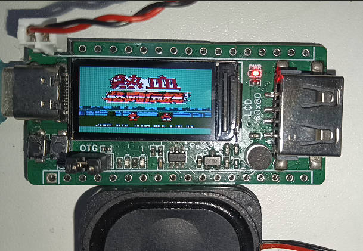
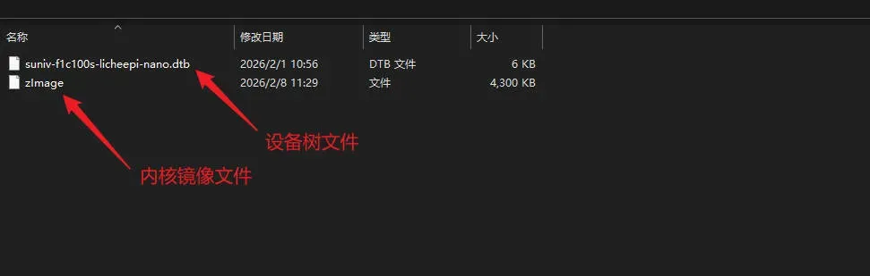
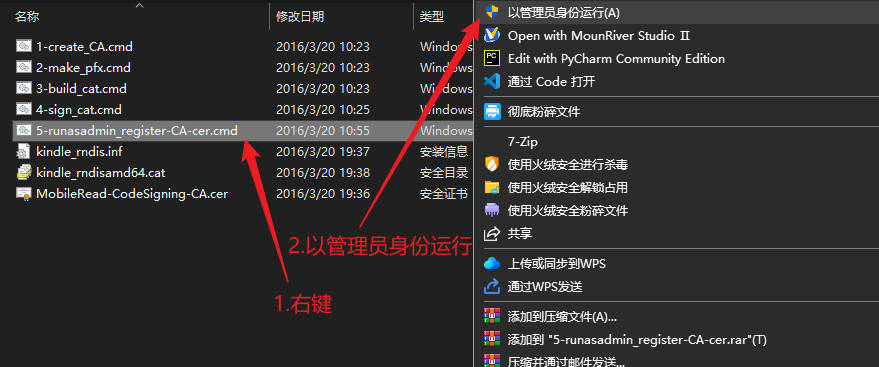
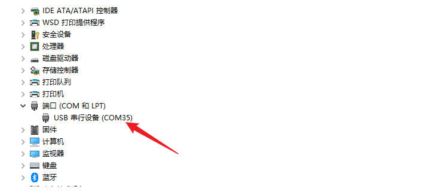
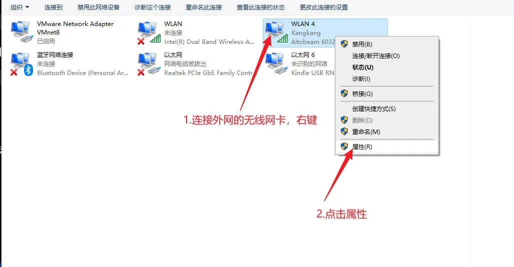
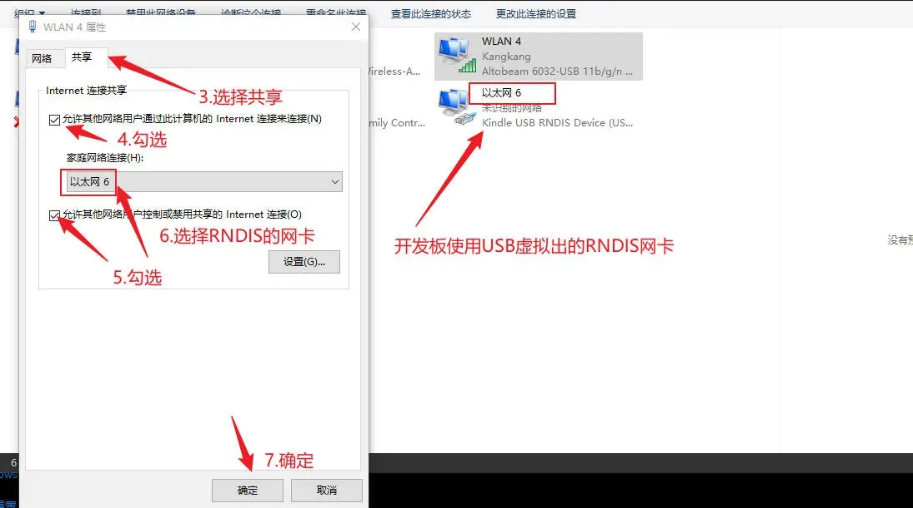
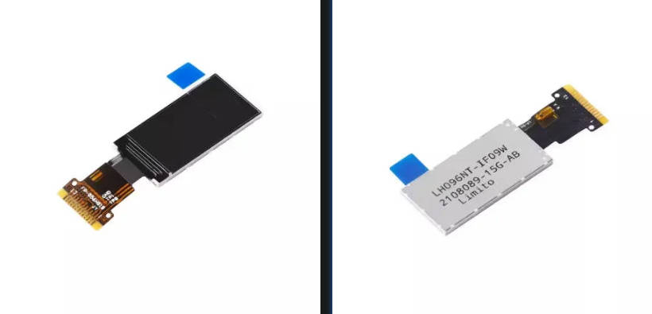
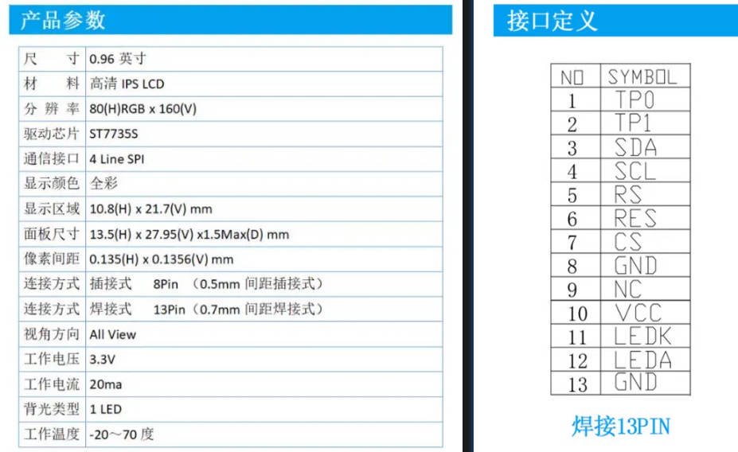
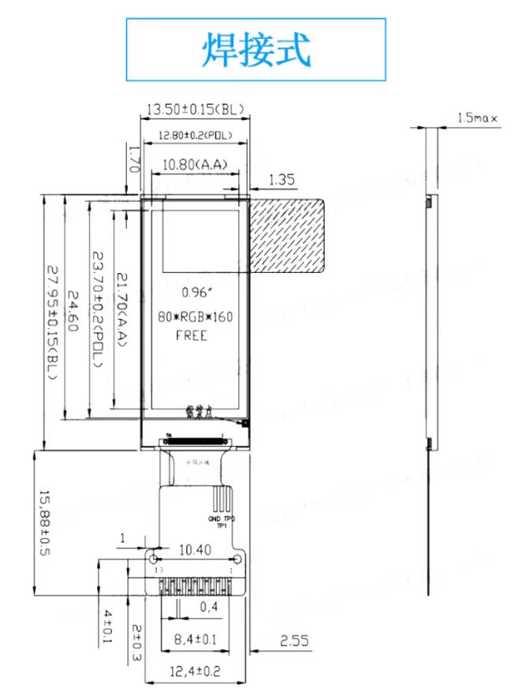

# Planck-Pi-V2.0

# 一.项目介绍
这是基于稚晖君Planck-Pi的升级版本,屏幕从单色的OLED屏改成彩色的LCD屏，游玩体验更佳。

# 二.演示视频
B站视频：https://www.bilibili.com/video/BV1M1cxzrEk3/

# 三.硬件焊接
可以参考该文档：https://blog.csdn.net/qq_43257914/article/details/125353029

# 四.镜像烧录
1.由于镜像文件比较大，我已经上传到阿里云盘。
下载地址是：https://pan.quark.cn/s/6649314aff11

2.先用7z软件解压我提供的Debian Linux镜像，镜像大小是4GB的，所以需要先准备一张4G以上容量的 TF 卡，然后使用 SD Card Formatter 软件格式化TF卡，最后再用Win32Diskimager 软件写入镜像。

3.TF卡格式化和镜像烧录的详细步骤可参考这篇文章：
http://www.orangepi.cn/orangepiwiki/index.php?title=%E4%BD%BF%E7%94%A8_Win32Diskimager_%E7%83%A7%E5%BD%95_Linux_%E9%95%9C%E5%83%8F%E7%9A%84%E6%96%B9%E6%B3%95

4.镜像默认是使用USB转串口登录系统(typec线需正向插入typec口)。
账号：root，密码：123456
里面的/home目录下的/mp4和/nes目录分别准备了一些视频和nes游戏，可以供复刻的同学验证音视频功能。
先进入到/mp4目录下，播放视频的指令是：
```
mplayer xxx.mp4
```
先进入到/nes目录下，玩nes游戏的指令是:
```
./InfoNES xxx.nes
```

# 五.USB联网
1.如果希望使用USB联网，需要先把TF卡分区1的设备树文件替换成可以使用RNDIS进行USB联网的设备树文件。
由于分区1的文件系统是fat格式的，所以可以直接在Windows系统下查看和修改TF卡分区1的zImage内核镜像文件和dtb设备树文件。


2.解压附件的RNDIS驱动，以管理员身份运行5-runasadmin_register-CA-cer.cmd这个文件。


3.把typec线反向插入typec口，可以在设备管理器看到USB串行设备


4.接下来，可以参考这篇文章完成RNDIS驱动的安装
https://wiki.sipeed.com/hardware/zh/maixsense/maixsense-a075v/install_drivers.html

5.安装完RNDIS驱动后，可以尝试在cmd下敲ping指令，看看能不能ping通
```
ping 192.168.137.2
```
再看看能不能ssh登录到开发板
```
ssh root@192.168.137.2
```
6.连接外网需要使用网络共享功能，把PC电脑上连接外网的网卡共享给开发板RNDIS网卡，如下图所示：


7.此时可以使用ssh远程登录到开发板，然后敲ping指令：
```
ping www.baidu.com
```
看看能不能ping通百度，如果可以，说明已经可以连接到外网。
注意：如果开发板又出现无法ping通外网的情况，可以试试重新进行网络共享。

# 六.LCD选型
这里选用的是一款与原版Planck-Pi相同分辨率160x80的LCD，驱动IC是ST7735S,接口类型是SPI。

购买链接：https://item.taobao.com/item.htm?abbucket=9&id=674578552451&mi_id=0000oxz9UuI0sgz62a3BnKWiR9raLUHDe2irLm_QI5D-bQ8&ns=1&skuId=4857619349892&spm=a21n57.1.hoverItem.6&utparam=%7B%22aplus_abtes




# 七.软件开发
可以参考该文档：https://wiki.sipeed.com/soft/Lichee/zh/Nano-Doc-Backup/index.html

# 八.参考开源项目
https://github.com/peng-zhihui/Planck-Pi
